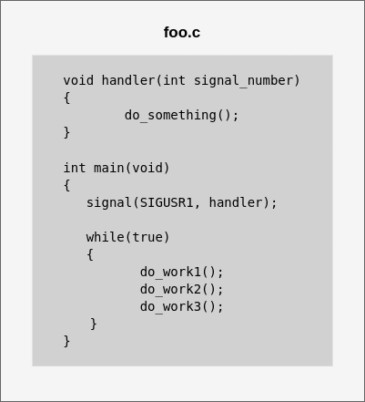

<p align="center">
  
</p>

# _Signal_

## Tópicos
* [Introdução](#introdução)
* [Implementação](#implementação)
* [launch_processes](#launch_processes)
* [button_interface](#button_interface)
* [led_interface](#led_interface)
* [Compilando, Executando e Matando os processos](#compilando-executando-e-matando-os-processos)
* [Compilando](#compilando)
* [Clonando o projeto](#clonando-o-projeto)
* [Selecionando o modo](#selecionando-o-modo)
* [Modo PC](#modo-pc)
* [Modo RASPBERRY](#modo-raspberry)
* [Executando](#executando)
* [Interagindo com o exemplo](#interagindo-com-o-exemplo)
* [MODO PC](#modo-pc-1)
* [MODO RASPBERRY](#modo-raspberry-1)
* [Matando os processos](#matando-os-processos)
* [Conclusão](#conclusão)
* [Referência](#referência)

## Introdução
Signal é uma notificação que avisa um determinado processo que um evento ocorreu. Signal é considerado uma interrupção por software, similiar a interrupção via hardware, onde quando há um evento, o fluxo do programa é alterado, normalmente chamando uma função que foi registrada para ser invocada quando esse sinal acontecer. Signal pode ser considerado um IPC porém não transmite dados, e são assíncronos, mas quando um processo o recebe, interrompe o processamento atual para atender o evento, ou seja, assim que um evento é recebido, o processamento é imediato, como boa prática os handlers registrados para os sinais devem possui uma rotina muito pequena para o tratamento desse sinal, para que possa retornar rapidamente para o ponto onde foi interrompido. Existem 31 sinais sendo que alguns deles podem ser gerados através do teclado como o SIGINT, os sinais existentes estão definidos em /usr/include/bits/signum.h para 32bits, /usr/include/x86_64-linux-gnu/bits/signum.h para 64 bits e /usr/include/arm-linux-gnueabihf/bits/signum.h para ARM. 

## Registrando uma Callback para um Signal

Para realizar um registro de uma callback faz-se o uso da _system call_
```c
#include <signal.h>

typedef void (*sighandler_t)(int);

sighandler_t signal(int signum, sighandler_t handler);
```

Onde a callback deve respeitar a assinatura do _sighandler_, que recebe um argumento do tipo int e não retorna nada

## Emitindo um Signal

Com Signal é possível emitir o evento para si mesmo através da _system call_

```c
#include <signal.h>

int raise(int sig);
```

ou para um processo externo, nesse caso é necessário conhecer o pid do processo no qual se quer enviar

```c
#include <sys/types.h>
#include <signal.h>

int kill(pid_t pid, int sig);
```

## Aguardando um Signal

Para fazer com que o programa somente processe mediante a um evento, pode-se usar a _system call_

```c
#include <unistd.h>

int pause(void);
```

que permite que o programa entre em sleep até que um Signal seja recebido para assim acordar e processar.

## Funcionamento da recepção de um Signal

Para exemplificar melhor é apresentado uma imagem animada que demonstra o fluxo de um programa em execução, e como é realizado o tratamento do evento

<p align="center">
  
</p>

Pode-se se notar no programa que, em nenhum momento é chamado o handler, mas mediante o registro prévio do callback, quando o evento é gerado, o callback é invocado, trata o sinal e retoma o fluxo normal após o tratamento do evento.

## Implementação

Para demonstrar o uso desse IPC, iremos utilizar um esquema de notifição, onde o processo Notificador (_button_process_) vai notificar o processo Consumidor(_led_process_) que está em sleep aguardando a notificação para alterar seu estado, essa aplicação é composta por 3 executáveis:

* _launch_processes_ - é responsável por lançar os processos _button_process_ e _led_process_ atráves da combinação _fork_ e _exec_
* _button_interface_ - é reponsável por ler o GPIO em modo de leitura da Raspberry Pi e enviar um evento Signal
* _led_interface_ - é reponsável por aguardar um Signal e mudar o estado do GPIO configurado como saída

### *launch_processes*

No _main_ criamos duas variáveis para armazenar o PID do *button_process* e do *led_process*, e um buffer que vai ser formatado para enviar argumentos para o processo *led_process*
```c
int pidLed;
int pidButton;
char args[BUFSIZ + 1];
```

Em seguida lançamos o processo *led_process*
```c
pidLed = fork();
if(pidLed == 0)
{        
    memset(args, 0, sizeof(args));        
    (void)execl("led_process", "led_process", NULL, (char *)0);
    exit(EXIT_FAILURE);
} 
```

Nesse ponto temos o pid do processo *led_process*, que será passado para o processo *button_process* como argumento para que seja possível notificá-lo

```c
else if(pidLed > 0)
{
    pidButton = fork();
    if(pidButton == 0)
    {            
        memset(args, 0, sizeof(args));
        sprintf(args, "%d", pidLed);
        (void)execl("button_process", "button_process", args, (char *)0);
        exit(EXIT_FAILURE);
    }
}
```

## *button_interface*
Definimos a variável que vai receber o argumento recebido via _exec_
```c
int pidLed;
```

Verificamos se o argumento é válido

```c
if(argv[1][0] == '\0')
  return false;
```

Inicializamos a interface de botão

```c
if (button->Init(object) == false)
  return false;
```

Recuperamos o pid do processo *led_process*
```c
sscanf(argv[1], "%d", &pidLed);
```

Aguardamos o pressionamento do botão e por fim notificamos o processo *led_process* através do _kill_

```c
wait_press(object, button);
kill(pidLed, SIGUSR1);
```

## *led_interface*
Definimos uma variável para controlar o estado interno do LED

```c
int state = 0
```

Registramos o sinal que desejamos receber
```c
signal(SIGUSR1, recv_sig);
```

Inicializamos a interface de LED
```c
if (led->Init(object) == false)
  return false;
```

Aplicamos o estado inicial do LED, alteramos o estado interno e colocamos o processo em modo sleep, que aguarda um evento para aplicar o novo estado
```c
led->Set(object, (uint8_t)state);
state ^= 0x01;
pause();
```

## Compilando, Executando e Matando os processos
Para compilar e testar o projeto é necessário instalar a biblioteca de [hardware](https://github.com/NakedSolidSnake/Raspberry_lib_hardware) necessária para resolver as dependências de configuração de GPIO da Raspberry Pi.

## Compilando
Para faciliar a execução do exemplo, o exemplo proposto foi criado baseado em uma interface, onde é possível selecionar se usará o hardware da Raspberry Pi 3, ou se a interação com o exemplo vai ser através de input feito por FIFO e o output visualizado através de LOG.

### Clonando o projeto
Pra obter uma cópia do projeto execute os comandos a seguir:

```bash
$ git clone https://github.com/NakedSolidSnake/Raspberry_IPC_Signal
$ cd Raspberry_IPC_Signal
$ mkdir build && cd build
```

### Selecionando o modo
Para selecionar o modo devemos passar para o cmake uma variável de ambiente chamada de ARCH, e pode-se passar os seguintes valores, PC ou RASPBERRY, para o caso de PC o exemplo terá sua interface preenchida com os sources presentes na pasta src/platform/pc, que permite a interação com o exemplo através de FIFO e LOG, caso seja RASPBERRY usará os GPIO's descritos no [artigo](https://github.com/NakedSolidSnake/Raspberry_lib_hardware#testando-a-instala%C3%A7%C3%A3o-e-as-conex%C3%B5es-de-hardware).

#### Modo PC
```bash
$ cmake -DARCH=PC ..
$ make
```

#### Modo RASPBERRY
```bash
$ cmake -DARCH=RASPBERRY ..
$ make
```

## Executando
Para executar a aplicação execute o processo _*launch_processes*_ para lançar os processos *button_process* e *led_process* que foram determinados de acordo com o modo selecionado.

```bash
$ cd bin
$ ./launch_processes
```

Uma vez executado podemos verificar se os processos estão rodando atráves do comando 
```bash
$ ps -ef | grep _process
```

O output 
```bash
pi        2773     1  0 10:25 pts/0    00:00:00 led_process
pi        2774     1  1 10:25 pts/0    00:00:00 button_process 2773
```
## Interagindo com o exemplo
Dependendo do modo de compilação selecionado a interação com o exemplo acontece de forma diferente

### MODO PC
Para o modo PC, precisamos abrir um terminal e monitorar os LOG's
```bash
$ sudo tail -f /var/log/syslog | grep LED
```

Dessa forma o terminal irá apresentar somente os LOG's referente ao exemplo.

Para simular o botão, o processo em modo PC cria uma FIFO para permitir enviar comandos para a aplicação, dessa forma todas as vezes que for enviado o número 0 irá logar no terminal onde foi configurado para o monitoramento, segue o exemplo
```bash
echo "0" > /tmp/signal_file
```

Output do LOG quando enviado o comando algumas vezez
```bash
Apr  6 06:22:37 cssouza-Latitude-5490 LED SIGNAL[4277]: LED Status: On
Apr  6 06:22:39 cssouza-Latitude-5490 LED SIGNAL[4277]: LED Status: Off
Apr  6 06:22:40 cssouza-Latitude-5490 LED SIGNAL[4277]: LED Status: On
Apr  6 06:22:40 cssouza-Latitude-5490 LED SIGNAL[4277]: LED Status: Off
Apr  6 06:22:41 cssouza-Latitude-5490 LED SIGNAL[4277]: LED Status: On
Apr  6 06:22:42 cssouza-Latitude-5490 LED SIGNAL[4277]: LED Status: Off
```

### MODO RASPBERRY
Para o modo RASPBERRY a cada vez que o botão for pressionado irá alternar o estado do LED.

## Matando os processos
Para matar os processos criados execute o script kill_process.sh
```bash
$ cd bin
$ ./kill_process.sh
```

## Conclusão
Signal é um IPC bastante versátil, apesar de não trafegar dados, mas permite de forma rápida e simples a sincronização entre os processos, como no [Shared File](https://github.com/NakedSolidSnake/Raspberry_IPC_SharedFile), que é usado o polling para verificar se o arquivo está em uso, podemos remover o polling e usar a notificação para que o processo leia quando e somente for atualizado, reduzindo assim processamento desnecessário.

## Referência
* [Link do projeto completo](https://github.com/NakedSolidSnake/Raspberry_IPC_Signal)
* [Mark Mitchell, Jeffrey Oldham, and Alex Samuel - Advanced Linux Programming](https://www.amazon.com.br/Advanced-Linux-Programming-CodeSourcery-LLC/dp/0735710430)
* [fork, exec e daemon](https://github.com/NakedSolidSnake/Raspberry_fork_exec_daemon)
* [biblioteca hardware](https://github.com/NakedSolidSnake/Raspberry_lib_hardware)

